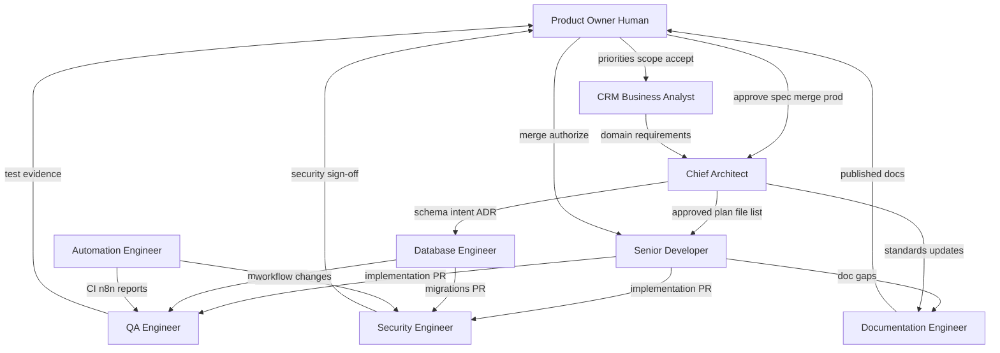

# AI Agent Registry — Free Energy Help AI Development Factory

**Version:** FACTORY-003  
**Status:** Active  
**Scope:** Documentation only. This registry governs all AI and human roles in the development factory.

## Purpose

Define who may plan, build, review, document, automate, and approve work on **free-energy-help-ai-os** so agents stay within safe boundaries and humans retain control of production and data.

## Role index

| Role | Type | Charter |
|------|------|---------|
| Chief Architect | AI | [chief-architect.md](./roles/chief-architect.md) |
| Senior Developer | AI | [senior-developer.md](./roles/senior-developer.md) |
| Database Engineer | AI | [database-engineer.md](./roles/database-engineer.md) |
| QA Engineer | AI | [qa-engineer.md](./roles/qa-engineer.md) |
| Security Engineer | AI | [security-engineer.md](./roles/security-engineer.md) |
| Documentation Engineer | AI | [documentation-engineer.md](./roles/documentation-engineer.md) |
| Automation Engineer | AI | [automation-engineer.md](./roles/automation-engineer.md) |
| CRM Business Analyst | AI | [crm-business-analyst.md](./roles/crm-business-analyst.md) |
| Product Owner | **Human** | [product-owner.md](./roles/product-owner.md) |

---

## 1. Agent communication diagram

**Message rules**

- Specs and plans flow **down** from Product Owner → Analyst → Chief Architect → implementers.
- Evidence flows **up** via PR + registers to QA and Security, then Product Owner for merge and production gates.
- Agents do not instruct the Product Owner; they **escalate** with options and risks.

---

## 2. Approval chain

| Stage | Approver | Required artefact |
|-------|----------|-------------------|
| Backlog intake | Product Owner (Human) | Queue item / priority |
| Business intent | Product Owner (Human) | Analyst summary accepted |
| Technical spec | Product Owner (Human) | Chief Architect plan approved in writing |
| Schema / migration design | Product Owner (Human) + Security Engineer (review) | Migration file + ADR if breaking |
| Code merge to `main` | Product Owner (Human) | Green CI + QA evidence + Security clearance (if applicable) |
| Staging Supabase apply | Product Owner (Human) | Documented in PR / migration log |
| **Production deploy** | **Product Owner (Human) only** | Explicit written approval |
| **Production Supabase apply** | **Product Owner (Human) only** | Explicit written approval + backup note |

No AI role may self-approve merge to `main` or any production change.

---

## 3. File ownership matrix

| Path pattern | Primary owner | Secondary (review) |
|--------------|---------------|---------------------|
| `docs/factory/**` | Documentation Engineer | Chief Architect |
| `docs/factory/AGENT_REGISTRY.md` | Chief Architect | Product Owner |
| `docs/factory/roles/**` | Documentation Engineer | Chief Architect |
| `.cursor/rules/**` | Chief Architect | Security Engineer |
| `AGENTS.md`, root `README.md` | Documentation Engineer | Chief Architect |
| `.github/workflows/**` | Automation Engineer | Security Engineer |
| `supabase/migrations/**` | Database Engineer | Security Engineer, QA Engineer |
| `supabase/**` (non-migration) | Database Engineer | Chief Architect |
| `frontend/src/app/**` | Senior Developer | QA Engineer, CRM Business Analyst |
| `frontend/src/**` (non-app) | Senior Developer | Chief Architect |
| `frontend/package.json`, lockfile | Senior Developer / Automation Engineer | QA Engineer |
| `frontend/.env.example` | Security Engineer | Automation Engineer |

---

## 4. Which agent may modify which folders

| Folder / path | CA | SD | DB | QA | SEC | DOC | AUTO | BA | PO |
|---------------|:--:|:--:|:--:|:--:|:--:|:---:|:----:|:--:|:--:|
| `docs/factory/` | R | — | R | R | R | **W** | R | R | R |
| `docs/` (other) | R | — | — | R | R | **W** | R | **W** | R |
| `.cursor/rules/` | **W** | — | — | — | R | R | — | — | R |
| `.github/` | R | — | — | R | R | R | **W** | — | R |
| `supabase/migrations/` | R | — | **W** | R | R | — | — | — | R |
| `supabase/` (other) | R | — | **W** | — | R | R | — | — | R |
| `frontend/src/app/` | R | **W** | — | R | R | — | — | R | R |
| `frontend/src/` (else) | R | **W** | — | R | R | — | — | — | R |
| `frontend/` config | R | W | — | R | R | — | W | — | R |
| Root `AGENTS.md`, `README.md` | R | — | — | — | R | W | — | — | R |

**Legend:** **W** = may modify (within charter), **R** = read / review only, — = no direct modification.

---

## 5. Which agent may access Supabase

| Role | Repository (SQL migrations) | Supabase Dashboard / CLI (remote) |
|------|----------------------------|-----------------------------------|
| Chief Architect | Read | No remote access |
| Senior Developer | Read | No remote; use env only for local dev guidance |
| Database Engineer | **Write** migrations | **Staging apply** only with Product Owner approval; **never prod** without PO |
| QA Engineer | Read | Staging read-only smoke (credentials from PO) |
| Security Engineer | Read / review RLS in SQL | Review policies; no routine prod access |
| Documentation Engineer | Read | No |
| Automation Engineer | Read (lint only) | CI: no remote; placeholder env vars only |
| CRM Business Analyst | No | No |
| Product Owner (Human) | Read | **Only role** that may authorize production project changes |

**Rules**

- Service role keys are **never** stored in the repo or CI for PR checks.
- Anon/publishable keys only in `.env.local` / CI placeholders.
- Remote migration apply is **manual**, logged, and gated by Product Owner.

---

## 6. Which agent may approve production changes

| Change type | AI may approve? | Approver |
|-------------|-----------------|----------|
| Merge PR to `main` | No | Product Owner (Human) |
| Vercel / hosting production deploy | No | Product Owner (Human) |
| Supabase production migration | No | Product Owner (Human) |
| RLS / auth policy in production | No | Product Owner (Human) + Security Engineer review |
| New GitHub secrets (prod) | No | Product Owner (Human) |
| Staging deploy / staging migrate | No | Product Owner (Human) |

AI roles may **recommend** readiness; only **Product Owner (Human)** approves production.

---

## Factory handoff (typical feature)

1. **CRM Business Analyst** — business need, acceptance criteria draft.  
2. **Product Owner** — prioritise and accept scope.  
3. **Chief Architect** — plan, file list, risks; wait for PO approval.  
4. **Database Engineer** — migrations if needed (same branch or stacked PR).  
5. **Senior Developer** — implement on feature branch.  
6. **QA Engineer** — test evidence, CI confirmation.  
7. **Security Engineer** — review when auth, RLS, PII, or workflows change.  
8. **Documentation Engineer** — user-facing or factory docs as specified.  
9. **Automation Engineer** — CI/workflow updates when required.  
10. **Product Owner** — merge and production decisions.

---

## Success criteria (registry)

- Every agent task maps to one primary role in this registry.
- No role modifies paths outside its **W** column without Chief Architect plan update and PO approval.
- Production and remote Supabase apply require Product Owner written approval.
- Escalation paths are documented per role and end at Product Owner.

---

## Related documents

- [FEATURE_QUEUE.md](./FEATURE_QUEUE.md)
- [Root AGENTS.md](../../AGENTS.md)
- [.cursor/rules/00-core-workflow.mdc](../../.cursor/rules/00-core-workflow.mdc)
